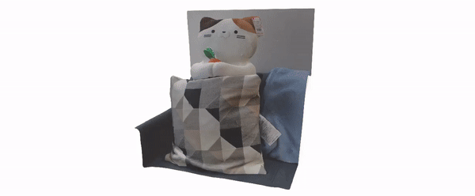
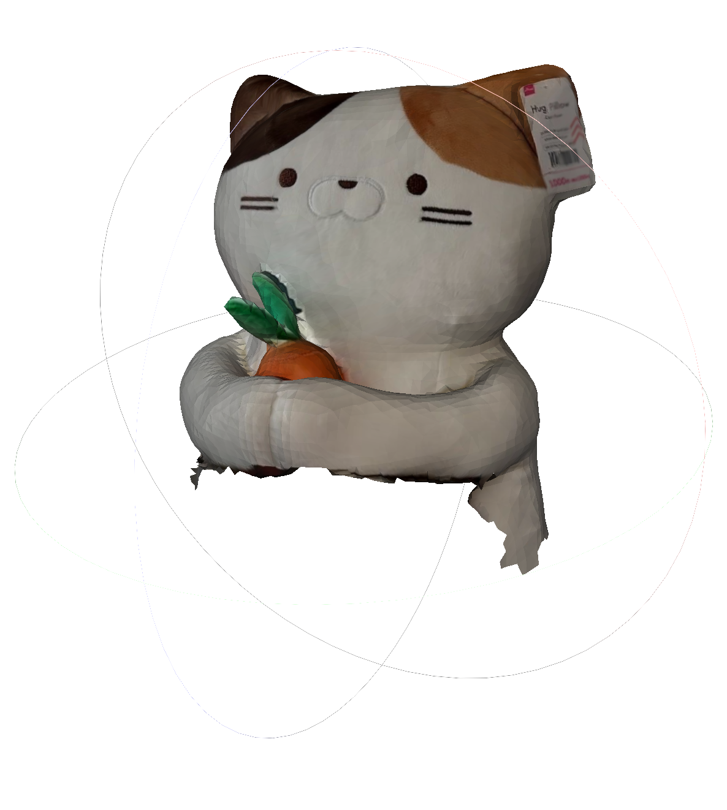
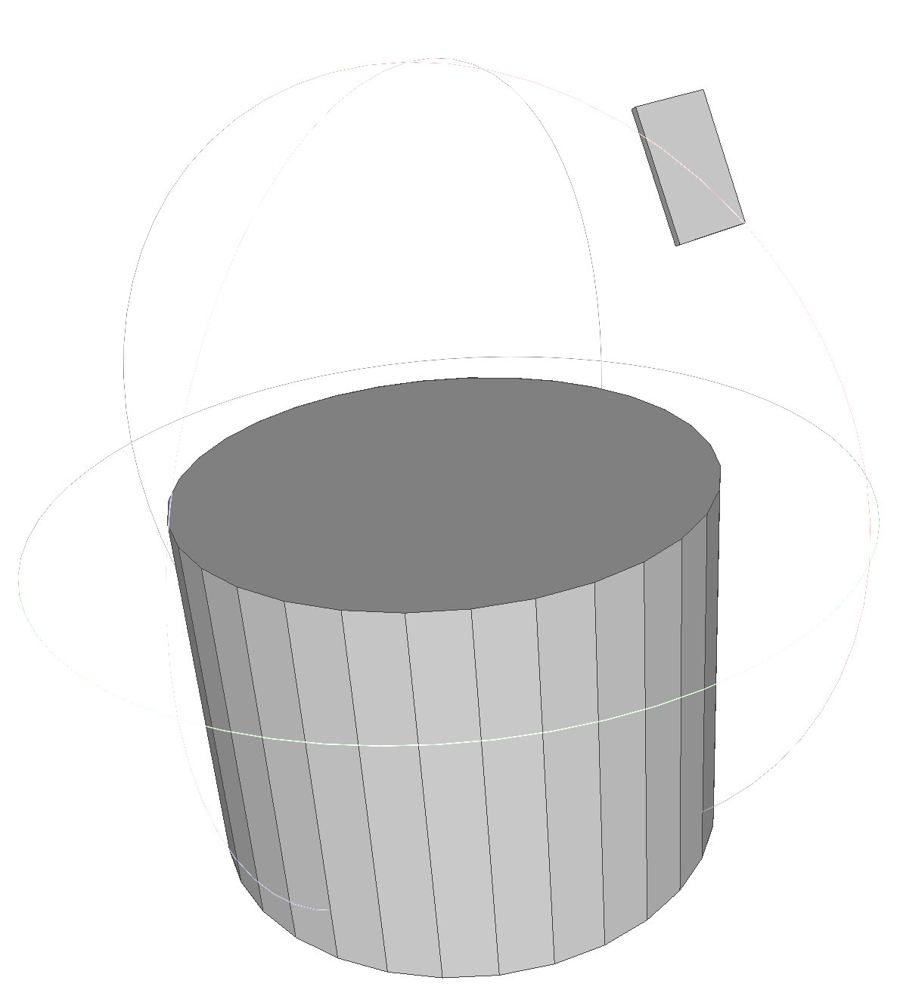
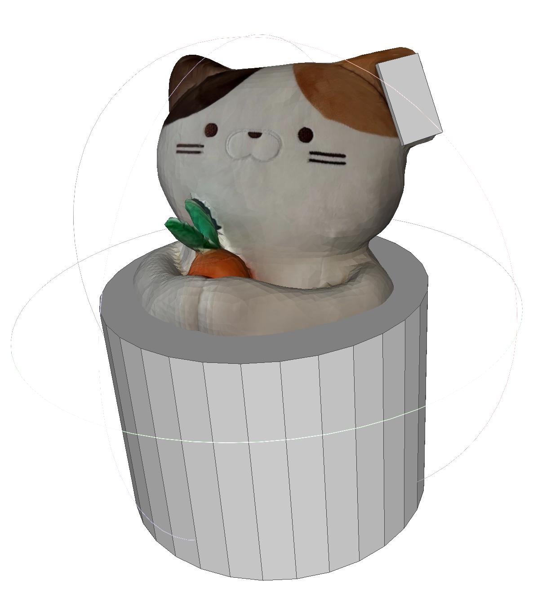

# NeRFiller: Completing Scenes via Generative 3D Inpainting

TLDR: NeRFiller completes missing regions in 3D scenes via an off-the-shelf 2D generative inpainter.

Project page at [https://ethanweber.me/nerfiller/](https://ethanweber.me/nerfiller/). Paper at [https://arxiv.org/abs/2312.04560](https://arxiv.org/abs/2312.04560).

<p align="center">
  
</p>

# Setup the environment

<details><summary>Here are the steps for installing all dependencies.</summary>

Clone this repo.

```bash
git clone git@github.com:ethanweber/nerfiller.git
```

Create a conda environment that has Nerfstudio installed. We tested with `nerfstudio` greater than version `1.0.0`. Then run,

```bash
pip install -e .
```

</details>

<br>

# Download and process data

Download the NeRF synthetic data

```bash
python nerfiller/scripts/download.py blender
```

Download the meshes that we will complete with NeRFiller

```bash
python nerfiller/scripts/download.py meshes
```

Download the backpack capture from SPIn-NeRF, formatted as a Nerfstudio dataset

```bash
python nerfiller/scripts/download.py nerfstudio
```

Download the novel-view camera paths.

```bash
python nerfiller/scripts/download.py camera-paths
```

Download the [LaMa](https://github.com/advimman/lama) inpainter weights

```bash
python nerfiller/scripts/download.py models
```

Convert the blender datasets to Nerfstudio format.

Use [blender_to_nerfstudio.py](nerfiller/scripts/blender_to_nerfstudio.py) for converting blender data to nerfstudio datasets. Run `ns-launch blender-to-nerfstudio --dry-run` to to see all the commands you need to run, one per dataset, for a total of 8. Running it without `--dry-run` will run all the commands. I prefer to run all commands in a `tmux` session in case they take a while to run.

```bash
ns-launch blender-to-nerfstudio
```

Use [create_nerfstudio_dataset.ipynb](notebooks/create_nerfstudio_dataset.ipynb) to render the meshes into nerfstudio datasets. This will require going into the notebook and running it from start to completition, where you modify the variable `dataset_name` each time. The dataset variables should be the name of the meshes in the folder [data/meshes](data/meshes). This is where you'd want to add your own custom data. For example, let's look at the dataset `cat` with an explanation for each file.

```bash
cat/
  |- jerrypillow.jpg    # texture file
  |- model.mtl          # model material file
  |- model.obj          # model obj (name is important)
  |- occlusion.obj      # occlusion obj (name is important)
```

The filenames for `model.obj` and `occlusion.obj` are important, and should be the same for each dataset so the notebook can properly process it based on the specified `dataset_name`. The model will reference it's material and texture files, and the occlusion file will be used to mark regions of the mesh in 3D which we want to inpaint. We call the texture file `jerrypillow.jpg` because the cat plushie is named Jerry. 🙂

| <br/> Cat mesh | <br/> Occlusion mesh (manually made) | <br/>Cat mesh & occlusion |
| :---: | :---: | :---: |

The cat mesh was created by scanning a scene with [Polycam](https://poly.cam/captures), exporting the mesh and loading it into Blender, and then deleting vertices and faces. The occluder wsa manually created in Blender too. Both the mesh (left) and occluder (middle) were explored to the files `model.obj` and `occlusion.obj`, respectively, where we keep the material and texture files for the model. The composited result is on the right.

## Using your own data

*If you want to use your own data, you can make a folder like specified above. Blender is useful is you want to export to OBJ files, which is what we require. In the notebook, you'll need to add another entry for your dataset in the `dataset_configs` dictionary.*

# Experiments

Run `ns-launch --help` for replicating our experiments. Run commands with `--dry-run` to see what the individual jobs will be. Edit [nerfiller/experiments/data.py](nerfiller/experiments/data.py) if you'd like to run on your own data! You'll need to modify the beginning lines of the file.

Next, we will show how to run experiments on all of our data for completing large unknown 3D regions. We refer to these experiments as the "occluder" experiments. This will involve editing the file [nerfiller/experiments/occluder.py](nerfiller/experiments/occluder.py). You'd first uncomment as follows and run `ns-launch train-occluder`. This will train models on the visible regions.

```python
methods = [
    ("nerfacto-nerfiller-visualize", "none"),
    ("nerfacto-nerfiller", "none"), # this must be trained first, as the following depend on it
    # ("individual-inpaint-once", "individual-sd-image"),
    # ("individual-inpaint-once", "individual-lama"),
    # ("grid-prior-du-no-depth", "none"),
    # ("grid-prior-du", "none"),
    # ("individual-inpaint-du", "none"),
    # ("grid-prior-du-random-noise", "none"), # this is extra for an ablation
]
```

Next, you'd uncomment as follows, omitting the first two methods. These methods will start from the `nerfacto-nerfiller` method checkpoint, which was trained in the previous step. `grid-prior-du` is our main method, and the rest are baselines.

If you want to run the `individual-inpaint-once` baselines, first run `ns-launch inpaint-occluder`. This will inpaint the missing regions **once, and before** we train the NeRF. The `du` methods will inpaint iteratively with the dataset update strategy. The inpaints will be in the folders `data/nerfstudio/<dataset_name>-inpaint/<inpaint_method>/<timestamp>`.

```python
methods = [
    # ("nerfacto-nerfiller-visualize", "none"),
    # ("nerfacto-nerfiller", "none"), # this must be trained first, as the following depend on it
    ("individual-inpaint-once", "individual-sd-image"),
    ("individual-inpaint-once", "individual-lama"),
    ("grid-prior-du-no-depth", "none"),
    ("grid-prior-du", "none"),
    ("individual-inpaint-du", "none"),
    ("grid-prior-du-random-noise", "none"), # this is extra for an ablation
]
```

Finally, you can run `ns-launch render-occluder --help` and `ns-launch metrics-occluder --help` (in order, without `--help` or `--dry-run`). In general, we following a convention of training, rendering out the result, and finally, computing metrics. We use the notebook [notebooks/inpainting_consistency_table.ipynb](notebooks/inpainting_consistency_table.ipynb) for aggregating results and generating LaTeX tables.

If you want to create side-by-side comparison videos, use the notebook [notebooks/video_comparison.ipynb](notebooks/video_comparison.ipynb).

# Experimenting with inpaints

Use [notebooks/inpaint.ipynb](notebooks/inpaint.ipynb) to play around with inpainting a dataset in a notebook.

# Synthetic experiments

For the experiments on the Blender dataset, the series of commands will be `ns-launch inpaint-blender`, `ns-launch train-blender`,  `ns-launch render-blender`, and `ns-launch metrics-blender`. In this case, "blender" is used instead of "occluder" (as used previously). These are our one-word nicknames we use in the code to distinguish the different types of experiments performed in the paper.

# Using a reference inpaint

In order to do reference inpainting, you can place a reference image named `reference.png` inside a Nerfstudio dataset folder. E.g., if you look at `data/nerfstudio/cat`, you'll see the file [data/nerfstudio/cat/reference.png](data/nerfstudio/cat/reference.png). You can inpaint images with [notebooks/inpaint.ipynb](notebooks/inpaint.ipynb) until finding an example image that you like and then place it inside the Nerfstudio dataset folder. Then, you'll need to run the method for inpainting with a reference. Edit [nerfiller/experiments/data.py](nerfiller/experiments/data.py) as follows. Comment out lines of the `occluder_dataset_names` set such that only the datasets you care about are present. Mark if they are synthetic datasets or not in the variable `synthetic_dataset_names` as done with other datasets. This will change settings of Nerfacto, such as turning off scene contraction or setting a white or black background during training. Modify `dataset_name_method_modifications` as done for other examples if you want to use a text prompt with the reference inpaint. Finally, call `ns-launch train-reference --dry-run` to see the commands that would run. If you're happy with it, run without `--dry-run` or simply copy and paste the printed command and run on your own.

# Misc

<details><summary>Some files are included that aren't used in the main pipeline, but could be useful to reference. Here is a high-level overview of this miscellaneous code.</summary>

- *nerfiller/dreambooth/dataset.py* - Dataset code used for fine-tuning the SD inpainting models.
- *nerfiller/guidance/* - Experimental code for classifier-guidance when iterately denoising a diffusion model.
- *nerfiller/utils/* - Utils, including some extra code which may be useful to people.

- *scripts/blendernerf_to_nerfstudio.py.py* - Convert the [BlenderNeRF](https://github.com/maximeraafat/BlenderNeRF) dataset format to Nerfstudio dataset format.
- *scripts/train_dreambooth_lora.py* (*ns-dreambooth*) - Fine-tune an SD inpainting model on our data.
- *scripts/visualize_nerfstudio_dataset.py* - Visualize a Nerfstudio dataset.

- *notebooks/inpaint.ipynb* - If you want to play around with inpainting.
- *notebooks/novel_view_metrics.ipynb* - Notebook to test computing the novel-view metrics.
- *notebooks/spinnerf_to_nerfstudio.ipynb* - Code to convert from spinnerf to nerfstudio.
- *notebooks/upscale.ipynb* - Code to play with a SD upscaler in a notebook.

The folders [nerfiller/inpaint/models](nerfiller/inpaint/models) and [nerfiller/inpaint/saicinpainting](nerfiller/inpaint/saicinpainting) are taken from the [LaMa inpainter codebase](https://github.com/advimman/lama). We copied the code over to make it easier to use in our workflow. The LaMa module in [nerfiller/inpaint/lama_inpainter.py](nerfiller/inpaint/lama_inpainter.py) references these files, and the weights downloaded to `data/models/big-lama` in the initial README instructions are from a Google Drive folder, where we simply copied their original weights to our own folder for setup convenience.

*The MUSIQ metric is removed from our repo since we originally used the Tensorflow version from [https://tfhub.dev/google/musiq/ava/1](https://tfhub.dev/google/musiq/ava/1), which is difficult to install and get working within our PyTorch context. We commented the code out of [nerfiller/utils/metrics.py](nerfiller/utils/metrics.py) and manually return 0s for now. An equivalent PyTorch image quality model should be used instead.*

</details>

<br>

# Citing


If you find this code or data useful for your research, please consider citing the following paper:

    @inproceedings{weber2023nerfiller,
        title = {NeRFiller: Completing Scenes via Generative 3D Inpainting},
        author = {Ethan Weber and Aleksander Holynski and Varun Jampani and Saurabh Saxena and
            Noah Snavely and Abhishek Kar and Angjoo Kanazawa},
        booktitle = {CVPR},
        year = {2024},
    }